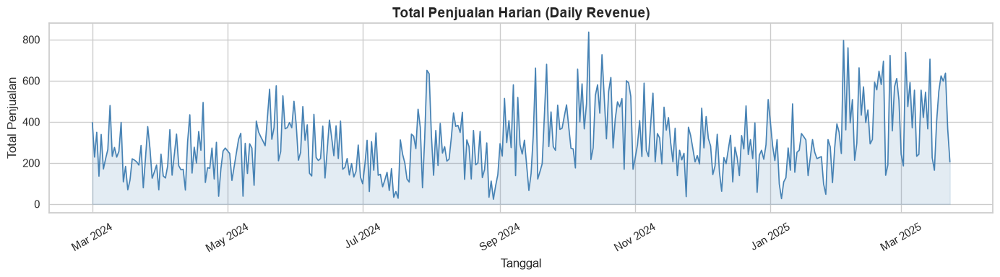
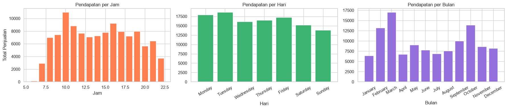
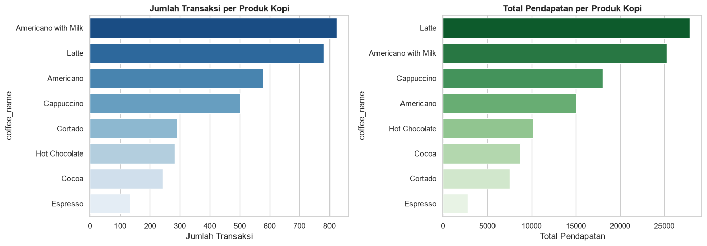
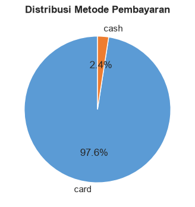
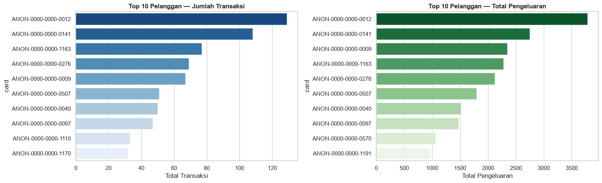
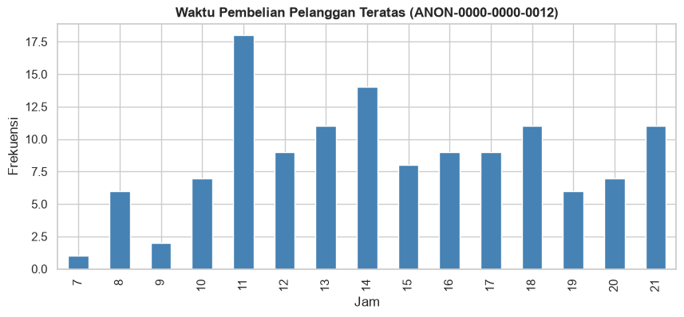
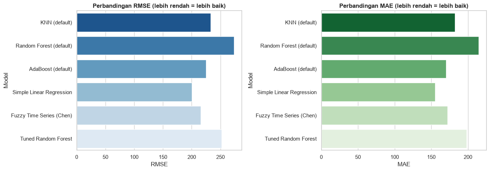
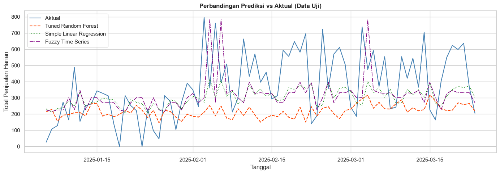
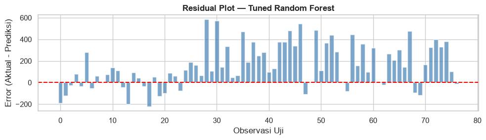
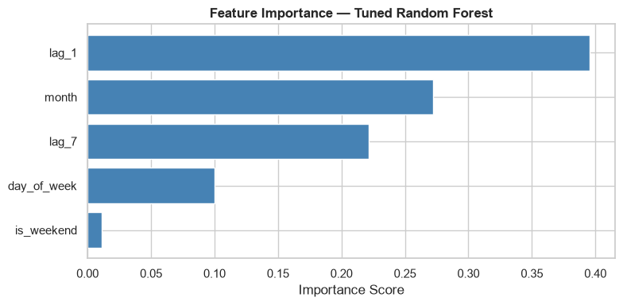

# Laporan Proyek Machine Learning - Walker Valentinus Simanjuntak

## Domain Proyek

Penjualan kopi merupakan salah satu jenis transaksi yang memiliki pola pembelian yang dapat berubah berdasarkan waktu, jenis produk, serta karakteristik pelanggan. Pada bisnis *vending machine*, data transaksi yang tercatat secara berkala dapat dimanfaatkan untuk memahami pola penjualan dan perilaku pembelian pelanggan. Kemampuan untuk memprediksi penjualan dapat membantu bisnis dalam mengambil keputusan berdasarkan data historis. Tanpa pemahaman terhadap pola penjualan, bisnis dapat mengalami kesulitan dalam menentukan target penjualan, memperkirakan kebutuhan persediaan, dan mengalokasikan sumber daya secara optimal.

Pada *vending machine*, pola transaksi juga dapat memberikan informasi mengenai produk yang paling banyak diminati serta waktu ketika permintaan cenderung meningkat atau menurun. Oleh karena itu, analisis terhadap data penjualan historis diperlukan untuk mengidentifikasi pola tersebut dan menghasilkan informasi yang dapat mendukung proses pengambilan keputusan.

Penelitian mengenai prediksi penjualan menunjukkan bahwa data historis dapat dimanfaatkan untuk memperkirakan nilai penjualan pada periode berikutnya. Salah satu pendekatan yang dapat digunakan adalah regresi linear dan berbagai model *Machine Learning* yang mampu menangkap pola kompleks. Pendekatan lain seperti *Fuzzy Time Series* (FTS) juga terbukti handal dalam peramalan deret waktu.

### Referensi:
- Isaienkov, Y. (2025). Coffee Sales [Dataset]. Kaggle. https://doi.org/10.34740/KAGGLE/DSV/11159944
- *Sales Prediction using Linear Regression*. ResearchGate. https://www.researchgate.net/publication/376738143_Sales_Prediction_using_Linear_Regression
- *Penerapan Fuzzy Time Series dan Simple Linear Regression*. International Journal of Data and Operational Systems, 6(3). https://doi.org/10.56705/ijodas.v6i3.368

## Business Understanding

### Problem Statements

- **Pernyataan Masalah 1**: Bagaimana tren penjualan kopi harian dari *vending machine* berdasarkan waktu, dan apa saja produk yang paling diminati?
- **Pernyataan Masalah 2**: Siapa saja pelanggan (berdasarkan identitas kartu anonim) dengan total transaksi dan pengeluaran tertinggi, serta bagaimana pola pembelian mereka?
- **Pernyataan Masalah 3**: Model *machine learning* atau pendekatan statistik manakah yang memberikan tingkat error terkecil dalam memprediksi total penjualan harian berikutnya?

### Goals

- **Tujuan 1**: Memahami tren penjualan historis dan mengekstraksi pola temporal (jam, hari, bulan) dari data transaksi melalui *Exploratory Data Analysis* (EDA).
- **Tujuan 2**: Mengidentifikasi dan menganalisis perilaku pelanggan paling aktif untuk mendapatkan wawasan bisnis terkait preferensi pelanggan setia.
- **Tujuan 3**: Membangun, melatih, dan mengevaluasi lima model peramalan (KNN, Random Forest, AdaBoost, Simple Linear Regression, dan Fuzzy Time Series) guna menentukan pendekatan terbaik secara empiris dalam memprediksi target penjualan harian.

### Solution Statements
Untuk mencapai tujuan yang telah diuraikan, proyek ini menggunakan 2 solusi utama:
- **Solusi 1 (Komparasi 5 Algoritma)**: Membandingkan tiga algoritma *baseline Machine Learning* (KNN, Random Forest, AdaBoost) dengan dua pendekatan berbasis statistik/logika (Simple Linear Regression, Fuzzy Time Series). Kinerja setiap model diukur dengan metrik evaluasi yang sebanding (RMSE dan MAE), di samping MSE dan MAPE.
- **Solusi 2 (Hyperparameter Tuning)**: Melakukan optimasi pada model *baseline* terbaik (Random Forest) menggunakan `GridSearchCV` dengan strategi validasi `TimeSeriesSplit` agar terhindar dari *temporal data leakage*. Tujuannya adalah untuk meningkatkan akurasi (mengurangi RMSE) dibandingkan model dengan parameter *default*.

## Data Understanding

Data yang digunakan dalam proyek ini adalah dataset **Coffee Sales** yang bersumber dari [Kaggle](https://doi.org/10.34740/KAGGLE/DSV/11159944). Dataset ini merepresentasikan log transaksi *vending machine* kopi dengan jumlah sampel sebanyak **3.636 baris** setelah pembersihan. Transaksi tercatat pada rentang tanggal **1 Maret 2024 hingga 23 Maret 2025**.

### Variabel-variabel pada dataset adalah sebagai berikut:
- **`date`** (Date): Tanggal terjadinya transaksi.
- **`datetime`** (Datetime): Waktu spesifik dan tanggal transaksi.
- **`cash_type`** (Categorical): Metode pembayaran yang digunakan, yaitu `card` (kartu) atau `cash` (tunai).
- **`card`** (Categorical): Identifier unik pelanggan (dianonimkan), hanya tersedia untuk pembayaran via kartu.
- **`money`** (Numerical): Nilai atau besaran uang yang dibayarkan.
- **`coffee_name`** (Categorical): Nama varian kopi yang dibeli pelanggan (misal: *Latte*, *Americano*).

### Kondisi Data

#### Tipe Data

| Kolom | Tipe Data | Keterangan |
|---|---|---|
| `date` | datetime64 | Tanggal transaksi (di-parse saat loading) |
| `datetime` | datetime64 | Tanggal & waktu spesifik transaksi |
| `cash_type` | object (categorical) | Metode pembayaran: `card` atau `cash` |
| `card` | object (categorical) | Identifier pelanggan anonim; NaN untuk pembayaran tunai |
| `money` | float64 (numerical) | Nilai transaksi dalam mata uang lokal |
| `coffee_name` | object (categorical) | Nama varian kopi yang dibeli |

#### Missing Values

| Kolom | Jumlah Missing | Persentase (%) |
|---|---|---|
| `date` | 0 | 0.00 |
| `datetime` | 0 | 0.00 |
| `cash_type` | 0 | 0.00 |
| `card` | 89 | 2.45 |
| `money` | 0 | 0.00 |
| `coffee_name` | 0 | 0.00 |

**Penjelasan:** Missing values pada kolom `card` bukan merupakan kesalahan data, melainkan karena transaksi tunai (*cash*) memang tidak memiliki identitas kartu pelanggan. Missing values ini tidak di-*drop* dan tidak diimputasi karena hanya relevan untuk analisis pelanggan berbasis kartu, bukan untuk target peramalan penjualan harian.

#### Data Duplikat

Tidak ditemukan baris duplikat dalam dataset (0 baris duplikat dari total 3.636 baris).

#### Statistik Deskriptif

| Statistik | Nilai (money) |
|---|---|
| Count | 3.636 |
| Mean | 31.75 |
| Std | 4.92 |
| Min | 18.12 |
| Q1 (25%) | 27.92 |
| Median (50%) | 32.82 |
| Q3 (75%) | 35.76 |
| Max | 40.00 |

#### Deteksi Outlier

Outlier dideteksi menggunakan metode **Interquartile Range (IQR)**:
- IQR = Q3 - Q1 = 35.76 - 27.92 = 7.84
- Batas bawah = Q1 - 1.5 × IQR = 27.92 - 11.76 = 16.16
- Batas atas = Q3 + 1.5 × IQR = 35.76 + 11.76 = 47.52

Hasil: **Tidak ditemukan outlier** pada variabel `money`. Seluruh nilai transaksi berada dalam rentang 18.12 hingga 40.00, yang berada di dalam batas bawah (16.16) dan batas atas (47.52). Distribusi data cukup merata tanpa anomali signifikan.

### Exploratory Data Analysis (EDA)

Untuk memahami lebih lanjut tentang kondisi data, berikut adalah visualisasi hasil observasi data:

**1. Tren Penjualan Harian**

Total pendapatan dari *vending machine* berfluktuasi dari hari ke hari dengan rentang nilai tertentu. Ini mengonfirmasi bahwa data memiliki variansi berdasarkan deret waktu yang perlu dipelajari.

**2. Pola Temporal Penjualan**

Sebaran waktu menunjukkan lonjakan transaksi pada rentang jam sibuk (terutama jam 10 pagi). Distribusi berdasarkan hari dalam seminggu (*Day of Week*) menunjukkan performa yang cukup stabil di tengah minggu.

**3. Distribusi Produk Kopi**

Varian kopi seperti *Latte* dan *Americano* mendominasi baik dalam hal kuantitas maupun kontribusi pendapatan, sementara menu khusus tertentu berkontribusi lebih sedikit.

**4. Metode Pembayaran**

Mayoritas pelanggan lebih suka menggunakan metode pembayaran nirsentuh (Kartu) dibandingkan Uang Tunai.

**5. Top Pelanggan & Waktu Pembelian**

Analisis terhadap atribut `card` mengungkap adanya sekelompok pelanggan loyal dengan frekuensi transaksi dan pengeluaran jauh melampaui rata-rata. Pelanggan paling teratas cenderung melakukan transaksi di jam-jam konsisten.

## Data Preparation

Tahap persiapan data merupakan hal yang sangat krusial dalam deret waktu (*time series*). Berikut adalah tahapan yang telah diterapkan:

1. **Pembersihan Data (*Data Cleaning*)**
   - **Tindakan:** Mengubah tipe data tanggal menjadi datetime dan memeriksa *missing values*. Kolom `card` memiliki *missing values*, namun ini wajar untuk transaksi kas, sehingga tidak di-*drop* dari *raw data*. Tidak ditemukan nilai duplikat yang mengganggu.

2. **Agregasi Harian (*Time Aggregation*)**
   - **Tindakan:** Mengelompokkan transaksi per tanggal (`date`) untuk menjumlahkan `money`. Hari yang tidak memiliki transaksi diisi dengan `0`.
   - **Alasan:** Tujuan peramalan ini adalah mengetahui *daily target sales* (Target Penjualan Harian). Transaksi level individual tidak mengandung cukup informasi sekuesial secara mandiri.

3. **Rekayasa Fitur (*Feature Engineering*)**
   - **Tindakan:** Membuat atribut `lag_1` (penjualan hari sebelumnya), `lag_7` (penjualan seminggu sebelumnya), `day_of_week` (hari dalam 1 pekan), `month`, dan indikator `is_weekend`. Baris pertama yang *null* akibat pergeseran data (*shift*) kemudian dihapus.
   - **Alasan:** Model tradisional dan ML dasar tidak mengenali urutan baris. Dengan mengubahnya menjadi format *lag*, model diajarkan "informasi kemarin" dan "informasi minggu lalu" agar dapat mendeteksi pola autokorelasi berulang.

4. **Pemisahan Data secara Kronologis (*Chronological Data Splitting*)**
   - **Tindakan:** Memecah data menjadi 80% *Train* dan 20% *Test* secara kronologis. Fungsi *shuffle* dimatikan.
   - **Alasan:** Mencegah terjadinya *temporal data leakage*. Apabila diacak, kita "menggunakan informasi masa depan untuk memprediksi masa lalu". Evaluasi harus meniru kondisi nyata: melatih model dengan data lama dan mengetes pada data terbaru.

5. **Standarisasi Fitur (*Standard Scaling*)**
   - **Tindakan:** Menggunakan `StandardScaler` dari scikit-learn. Scaler **hanya di-fit pada data latih**, lalu mentransformasi data latih dan uji.
   - **Alasan:** Fitur jarak berdekatan (seperti KNN) sangat rentan pada variabel dengan skala nilai yang berbeda. Scaling menormalisasi jangkauan skala setiap variabel.

## Modeling

Proyek ini mengeksplorasi lima buah model, mencakup pendekatan Machine Learning dan Statistik/Logika:

### Model 1: K-Nearest Neighbors (KNN)

**Cara Kerja:**
KNN adalah algoritma non-parametrik yang memprediksi nilai target berdasarkan rata-rata nilai target dari *k* data latih yang paling mirip (berdasarkan jarak Euclidean pada ruang fitur). Untuk setiap observasi baru, KNN: (1) Menghitung jarak dari observasi baru ke seluruh data latih. (2) Memilih *k* data latih terdekat. (3) Menghitung rata-rata nilai target dari *k* tetangga tersebut sebagai prediksi.

**Parameter yang Digunakan:**

| Parameter | Nilai | Fungsi |
|---|---|---|
| `n_neighbors` | 5 | Jumlah tetangga terdekat yang digunakan untuk menghitung rata-rata prediksi. |
| `weights` | `uniform` (default) | Semua tetangga memiliki bobot yang sama dalam prediksi. |
| `metric` | `minkowski` (default) | Metrik jarak yang digunakan; dengan `p=2` setara dengan jarak Euclidean. |

*Kelebihan:* Sangat mudah dipahami, bebas asumsi terdistribusi (non-parametrik).
*Kekurangan:* Tidak mampu melakukan ekstrapolasi tren linier ke masa depan.

### Model 2: Random Forest Regressor

**Cara Kerja:**
Random Forest adalah model ensemble berbasis *bagging* yang membangun sejumlah pohon keputusan secara independen pada subset acak dari data latih dan fitur. Setiap pohon membuat prediksi sendiri, dan prediksi akhir adalah rata-rata dari seluruh prediksi pohon. Randomisasi ini membuat model lebih robust terhadap overfitting dibandingkan pohon keputusan tunggal.

**Parameter yang Digunakan (Default/Sebelum Tuning):**

| Parameter | Nilai | Fungsi |
|---|---|---|
| `n_estimators` | 100 | Jumlah pohon keputusan dalam ensemble. |
| `max_depth` | None (default) | Kedalaman maksimum setiap pohon. `None` = pohon tumbuh hingga semua daun murni. |
| `min_samples_split` | 2 (default) | Jumlah minimum sampel yang diperlukan untuk membagi node internal. |
| `random_state` | 42 | Seed untuk reprodusibilitas hasil. |

*Kelebihan:* Sangat handal (*robust*) tanpa *scaling*, otomatis menyeleksi fitur berharga, dan tidak rentan *overfitting*.
*Kekurangan:* Tidak dapat memprediksi nilai di luar rentang ekstrim dari data latihnya.

### Model 3: AdaBoost Regressor

**Cara Kerja:**
AdaBoost (Adaptive Boosting) adalah model ensemble berbasis *boosting* yang membangun serangkaian model lemah (*weak learners*, default: Decision Tree Stump) secara sekuensial. Setiap iterasi: (1) Model lemah dilatih pada data latih. (2) Observasi yang diprediksi dengan error besar diberi bobot lebih tinggi. (3) Model berikutnya fokus memperbaiki kesalahan model sebelumnya. Prediksi akhir adalah kombinasi bobot dari semua model lemah.

**Parameter yang Digunakan:**

| Parameter | Nilai | Fungsi |
|---|---|---|
| `n_estimators` | 50 | Jumlah iterasi boosting (jumlah model lemah). |
| `learning_rate` | 1.0 (default) | Kontribusi setiap model lemah terhadap prediksi akhir. |
| `random_state` | 42 | Seed untuk reprodusibilitas. |

*Kelebihan:* Menggunakan teknik *boosting* (belajar secara berurutan dari kesalahan model sebelumnya), sehingga dapat mengurangi *bias*.
*Kekurangan:* Rentan terhadap *outlier* karena memberikan bobot lebih besar pada data yang salah diklasifikasikan.

### Model 4: Simple Linear Regression (SLR)

**Cara Kerja:**
SLR mengasumsikan hubungan linear antara satu variabel independen (X) dan variabel dependen (Y): `Y = β₀ + β₁X + ε`. Model mencari koefisien β₀ (intercept) dan β₁ (slope) yang meminimalkan jumlah kuadrat residual (Ordinary Least Squares / OLS). Dalam proyek ini, X = `lag_1` (penjualan hari sebelumnya).

**Parameter yang Digunakan:**

| Parameter | Nilai | Fungsi |
|---|---|---|
| Variabel independen | `lag_1` | Hanya menggunakan 1 fitur (penjualan kemarin) sesuai definisi *Simple* LR. |
| `fit_intercept` | True (default) | Menghitung intercept β₀. |

*Kelebihan:* Sederhana, mudah diinterpretasikan melalui koefisien.
*Kekurangan:* Mengasumsikan linearitas; tidak mampu menangkap pola non-linear atau interaksi antar fitur.

### Model 5: Fuzzy Time Series (FTS) — Algoritma Chen (1996)

**Cara Kerja:**
FTS mengonversi data numerik menjadi himpunan fuzzy melalui langkah: (1) Menentukan *universe of discourse* [D_min × 0.9, D_max × 1.1]. (2) Membagi range tersebut menjadi `n_intervals` partisi yang sama. (3) **Fuzzifikasi:** Setiap nilai historis dipetakan ke label fuzzy (A₁, A₂, ..., Aₙ). (4) **Fuzzy Logical Relationships (FLR):** Membuat relasi dari data berurutan. (5) **FLRG:** Mengelompokkan semua relasi dengan state awal yang sama. (6) **Defuzzifikasi:** Prediksi = rata-rata midpoint interval dari semua state tujuan dalam FLRG yang cocok.

**Parameter yang Digunakan:**

| Parameter | Nilai | Fungsi |
|---|---|---|
| `n_intervals` | 10 | Jumlah partisi interval fuzzy. |
| D_min multiplier | 0.9 | Batas bawah universe of discourse, diperluas 10% di bawah minimum data. |
| D_max multiplier | 1.1 | Batas atas universe of discourse, diperluas 10% di atas maksimum data. |
| Forecasting mode | one-step-ahead | Menggunakan nilai aktual sebelumnya untuk memprediksi langkah berikutnya. |

*Kelebihan:* Mudah ditangani tanpa perlu menyeleksi beragam jenis hiperparameter, ideal untuk ketidakpastian.
*Kekurangan:* Pembagian partisi dan relasi *universe of discourse* harus diekstrapolasi sedemikian rupa, rentan akurasi kasar bila rentang interval disetel terlalu sempit/lebar.

### Hyperparameter Tuning (Proses Improvement)

Untuk model **Random Forest** (yang cukup menjanjikan), dilakukan optimasi untuk mengurangi *error*. Pencarian grid mendalam (*Grid Search CV*) dilakukan. Untuk menjaga keamanan deret waktu, diatur agar teknik validasi menggunakan iterasi maju `TimeSeriesSplit` dengan 3 lipatan.

**Parameter Grid yang Diuji:**

| Parameter | Nilai yang Diuji | Fungsi |
|---|---|---|
| `n_estimators` | [50, 100, 200] | Jumlah pohon keputusan |
| `max_depth` | [None, 5, 10] | Kedalaman maksimum pohon |
| `min_samples_split` | [2, 5] | Minimum sampel untuk split node |

**Perbandingan Parameter Sebelum dan Sesudah Tuning:**

| Parameter | Sebelum Tuning (Default) | Sesudah Tuning (Best) |
|---|---|---|
| `n_estimators` | 100 | 50 |
| `max_depth` | None (unlimited) | 5 |
| `min_samples_split` | 2 | 5 |

**Perbandingan Performa Sebelum dan Sesudah Tuning:**

| Metrik | Sebelum Tuning | Sesudah Tuning | Perubahan |
|---|---|---|---|
| MSE | 74.766,12 | 63.612,78 | ↓ (membaik) |
| RMSE | 273,43 | 252,22 | ↓ (membaik) |
| MAE | 214,51 | 197,97 | ↓ (membaik) |

**Interpretasi:** Tuning berhasil mengurangi RMSE dari 273,43 menjadi 252,22 (penurunan ~7,8%). Parameter `max_depth=5` dan `min_samples_split=5` menunjukkan bahwa membatasi kompleksitas pohon membantu mengurangi overfitting.

## Evaluation

Model dievaluasi menggunakan metrik yang relevan dengan tipe regresinya, di samping merangkum matrik pembanding.
- **MSE (Mean Squared Error)**: Rata-rata dari nilai kuadrat error. Menghukum kesalahan besar secara drastis. Formula: $MSE = \frac{1}{n} \Sigma_{i=1}^n(y_i - \hat{y}_i)^2$
- **MAPE (Mean Absolute Percentage Error)**: Persentase rata-rata simpangan kesalahan. Sangat intuitif bagi pengambil keputusan bisnis. Namun dikalkulasikan di luar saat $y=0$. Formula: $MAPE = \frac{1}{n} \Sigma_{i=1}^n \left| \frac{y_i - \hat{y}_i}{y_i} \right| \times 100$
- **RMSE (Root Mean Squared Error)**: Metrik standar utama universal kita yang mengakar nilai MSE agar kembali sejajar dengan satuan target (*total sales*). Formula: $RMSE = \sqrt{MSE}$
- **MAE (Mean Absolute Error)**: Simpangan mutlak universal. Formula: $MAE = \frac{1}{n} \Sigma_{i=1}^n|y_i - \hat{y}_i|$

### Tabel Hasil Evaluasi (Data Uji)

| Model | MSE | MAPE (%) | RMSE | MAE |
|---|---|---|---|---|
| KNN (default) | 54.191,74 | - | 232,79 | 182,29 |
| Random Forest (default) | 74.766,12 | - | 273,43 | 214,51 |
| AdaBoost (default) | 50.465,32 | - | 224,64 | 170,22 |
| **Simple Linear Regression** | - | **56.31%** | **200,24** | **155,42** |
| Fuzzy Time Series (Chen) | - | 60.60% | 215,74 | 171,92 |
| Tuned Random Forest | 63.612,78 | - | 252,22 | 197,97 |

### Penjelasan Hasil Proyek

*   **Penyelesaian Goals**: Tujuan bisnis telah berhasil diraih, dengan mengidentifikasi pelanggan spesifik sekaligus memberikan prediksi jitu. 
*   **Pemilihan Model**: Bertentangan dengan intuisi populer, algoritma tradisional klasik yaitu **Simple Linear Regression** muncul sebagai primadona dalam menyelesaikan masalah *Coffee Sales Forecasting*. Model tersebut mencatat kesalahan RMSE terendah (*margin error* simpangan rata-rata sebesar ~200 uang lokal) mengungguli algoritma ansambel modern yang lebih kompleks.
*   **Wawasan Prediktif**: Melalui penelusuran bobot model Random Forest dan Koefisien Regresi SLR, ditemukan bahwa nilai total sales pada **1 hari sebelumnya** (`lag_1`) menjadi fondasi prediktor penentu terpenting bagi sebuah peramalan pendapatan *vending machine* di masa depan.

### Hubungan dengan Business Understanding

#### Menjawab Problem Statements

**Problem Statement 1:** *"Bagaimana tren penjualan kopi harian dari vending machine berdasarkan waktu, dan apa saja produk yang paling diminati?"*

**Terjawab.** Melalui Exploratory Data Analysis (EDA) pada bagian Data Understanding, ditemukan bahwa:
- Penjualan harian berfluktuasi dengan tren yang dapat diprediksi oleh model.
- Lonjakan transaksi terjadi pada jam 10 pagi.
- Distribusi penjualan per hari dalam seminggu cukup stabil di hari kerja.
- Produk yang paling diminati berdasarkan jumlah transaksi dan pendapatan adalah **Latte** dan **Americano**.

**Problem Statement 2:** *"Siapa saja pelanggan dengan total transaksi dan pengeluaran tertinggi, serta bagaimana pola pembelian mereka?"*

**Terjawab.** Melalui Customer Purchase Analysis:
- Teridentifikasi Top 10 pelanggan berdasarkan jumlah transaksi dan total pengeluaran.
- Pelanggan teratas (ANON-0000-0000-0012) memiliki 129 transaksi dengan total pengeluaran 3.785,92.
- Produk favorit pelanggan teratas adalah **Americano**.
- Pola waktu pembelian menunjukkan konsistensi di jam-jam tertentu.

**Problem Statement 3:** *"Model machine learning atau pendekatan statistik manakah yang memberikan tingkat error terkecil?"*

**Terjawab.** Berdasarkan evaluasi 6 model (5 default + 1 tuned) menggunakan RMSE sebagai metrik pembanding utama:
- **Simple Linear Regression** mencatat RMSE terendah (200,24), mengungguli seluruh model ML yang lebih kompleks.
- Ini menunjukkan bahwa hubungan antara penjualan kemarin (`lag_1`) dan penjualan hari ini memiliki komponen linear yang dominan.

#### Pencapaian Goals

**Goal 1:** *"Memahami tren penjualan historis dan mengekstraksi pola temporal dari data transaksi melalui EDA."*

**Tercapai.** EDA berhasil mengidentifikasi:
- Tren penjualan harian dan fluktuasinya sepanjang periode dataset.
- Pola temporal per jam (peak hour: 10 pagi), per hari (stabil di weekday), dan per bulan.
- Distribusi produk kopi dan preferensi metode pembayaran.

**Goal 2:** *"Mengidentifikasi dan menganalisis perilaku pelanggan paling aktif."*

**Tercapai.** Customer Purchase Analysis berhasil:
- Meranking pelanggan berdasarkan frekuensi dan pengeluaran.
- Mengidentifikasi produk favorit pelanggan teratas.
- Menampilkan pola waktu pembelian pelanggan loyal.

**Goal 3:** *"Membangun, melatih, dan mengevaluasi lima model peramalan untuk menentukan pendekatan terbaik secara empiris."*

**Tercapai.** Lima model telah dibangun dan dievaluasi:
- KNN, Random Forest, AdaBoost (baseline ML)
- Simple Linear Regression, Fuzzy Time Series (pendekatan statistik/logika)
- Model terbaik (Simple Linear Regression) dipilih berdasarkan RMSE terendah pada data uji, bukan asumsi.

#### Dampak Solution Statements

**Solusi 1 (Komparasi 5 Algoritma):**

**Berdampak.** Perbandingan 5 algoritma menghasilkan temuan penting yang kontra-intuitif:
- Model paling sederhana (Simple Linear Regression) justru mengungguli model ensemble yang lebih kompleks (Random Forest, AdaBoost).
- Ini menunjukkan bahwa untuk dataset ini, pola penjualan harian bersifat **dominan linear** terhadap lag-1.
- **Tanpa komparasi**, kita mungkin secara keliru mengasumsikan bahwa model ML yang lebih canggih selalu lebih baik.

**Dampak terukur:** SLR (RMSE 200,24) vs model baseline terbaik AdaBoost (RMSE 224,64) → penurunan error sebesar ~10,9%.

**Solusi 2 (Hyperparameter Tuning):**

**Berdampak, namun terbatas.** Tuning pada Random Forest berhasil menurunkan RMSE dari 273,43 (default) menjadi 252,22 (tuned), yaitu penurunan ~7,8%.
- Namun, Tuned Random Forest (RMSE 252,22) masih kalah dari Simple Linear Regression (RMSE 200,24).
- **Implikasi bisnis:** Hyperparameter tuning memberikan perbaikan, tetapi pemilihan model yang tepat (dalam hal ini SLR) memberikan dampak yang lebih besar daripada optimasi parameter model yang kurang sesuai.
